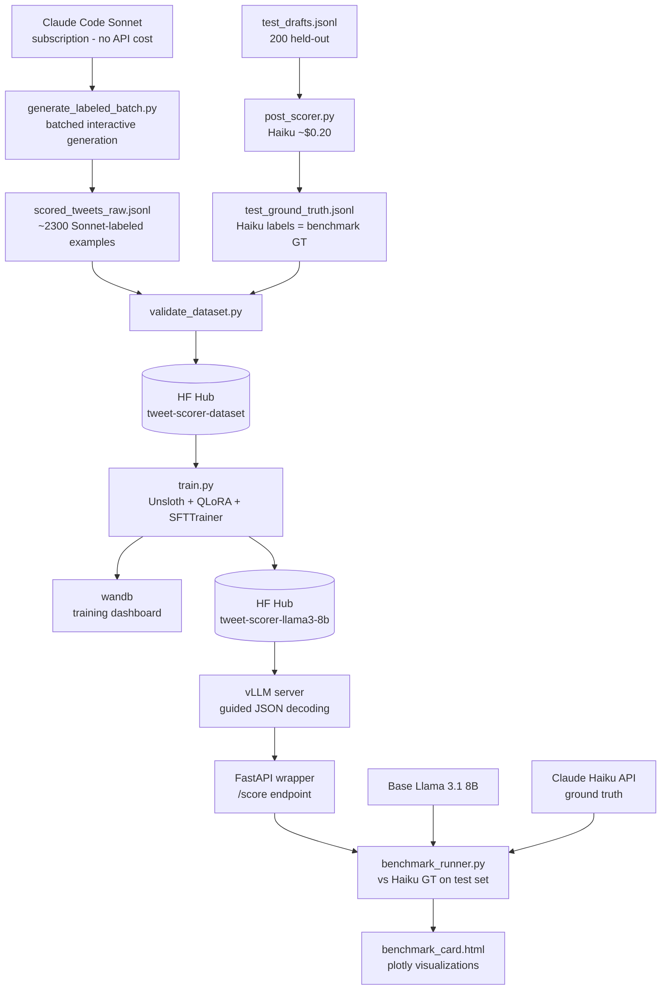

# Fine-Tuning + Open-Source Model Serving Pipeline

**Status:** Planning  
**Last Updated:** 2026-04-18  
**Target Roles:** Applied AI Engineer, ML/AI Infrastructure Engineer

---

## Table of Contents

1. [Project Overview](#1-project-overview)
2. [Architecture](#2-architecture)
3. [Directory Structure](#3-directory-structure)
4. [Tech Stack & Rationale](#4-tech-stack--rationale)
5. [Implementation Phases](#5-implementation-phases)
6. [Training Configuration](#6-training-configuration)
7. [vLLM Serving Configuration](#7-vllm-serving-configuration)
8. [Benchmark Design](#8-benchmark-design)
9. [Success Criteria](#9-success-criteria)
10. [Hugging Face Hub Strategy](#10-hugging-face-hub-strategy)
11. [Production-Grade Improvements](#11-production-grade-improvements)

---

## 1. Project Overview

### What This Project Is

An end-to-end ML pipeline that fine-tunes an open-source LLM (Llama 3.1 8B) to replicate and own the scoring logic from the `twitter-content-engine` project — without calling Claude or any commercial API at inference time.

The pipeline has three stages:

1. **Dataset generation** — Use Claude Code (Sonnet) interactively to produce ~2,000 labeled tweet scoring examples at zero API cost. Test-set ground truth (200 examples) is scored by the actual `post_scorer.py` using `claude-haiku-4-5-20251001`.
2. **Fine-tuning** — QLoRA fine-tuning via Unsloth + trl on the generated dataset. Output: a LoRA adapter published to Hugging Face Hub.
3. **Serving + benchmark** — Serve the fine-tuned model with vLLM (structured JSON output via guided decoding). Run a three-way benchmark: fine-tuned model vs. base Llama 3.1 8B vs. Claude Haiku.

### Connection to twitter-content-engine

`twitter-content-engine` generates tweet drafts and scores them across 6 dimensions using `claude-haiku-4-5-20251001`. The exact dimension names, weights, and composite formula must match precisely — they are the label schema this pipeline trains on.

| Dimension | Weight | Description |
|---|---|---|
| `hook_strength` | 25% | Harry Dry 3 tests: visualizable, falsifiable, unique. All 3 pass = 9+. Vague claims cap at 5. |
| `tone_compliance` | 20% | Six Core Laws. Zero hashtags, zero em-dashes, zero exclamation marks. **Any hashtag = 0/10.** |
| `x_algorithm_optimization` | 20% | X algo weights: replies=27x, retweets=20x. Debate-bait + data = 9+. Zero hashtags required for 9+. |
| `data_specificity` | 15% | Named people/tools, concrete numbers, falsifiable claims. Abstract claims cap at 6. |
| `pillar_alignment` | 15% | Pillar unmistakable in first sentence. Vague opener caps at 6. |
| `cta_quality` | 5% | TOFU-only: awareness/follow/debate-bait. No hard sell, no link drops. |

**Composite score formula:** `sum(score[dim] * weight[dim] / 100) + 0.5`

**Status thresholds:**
- `ready` ≥ 9.25
- `below_target` 8.0–9.24
- `failed_floor` < 8.0 (triggers regeneration)

**`never_list_violation`** — Boolean. Forces composite to 0.0 if any `#` is detected. Must be included in training labels.

**Hard rules** injected into generation (violations are caught pre-scoring):
- Zero hashtags (any `#` or fullwidth `＃`)
- Zero em-dashes (`\u2014`)
- Zero exclamation marks
- No soft CTAs: "What's your...", "Thoughts?", "Let's discuss", "Share your thoughts"
- No banned words: streamline, transformative, unlock, ecosystem, landscape, game-changer

This project treats that rubric as the ground truth label schema and trains a local model to produce identical structured outputs — converting "uses Claude for scoring" into "owns the scoring model."

### What This Demonstrates to Recruiters

Every other project in this portfolio calls commercial APIs. This project shows competency **below the API surface**:

- Synthetic dataset design and curation at scale
- QLoRA / PEFT parameter-efficient fine-tuning
- 4-bit quantization (bitsandbytes / Unsloth)
- High-throughput inference with vLLM and PagedAttention
- Structured output enforcement via guided decoding (not prompt hacking)
- Cost vs. quality benchmarking — an infrastructure engineer's core trade-off
- Model artifact management (adapters, quantized checkpoints, model cards)

This is the missing "I understand what the model is doing" signal for ML Infra roles.

---

## 2. Architecture

### High-Level Pipeline

```
┌─────────────────────────────────────────────────────────────────────┐
│                       STAGE 1: DATASET                              │
│                                                                     │
│  Claude Code (Sonnet) ──► generate_labeled_batch.py                │
│  [subscription, no API cost]   │                                    │
│                                ▼                                    │
│                    scored_tweets_raw.jsonl (~2,300 train+val)       │
│                                                                     │
│  + test_drafts.jsonl ──► post_scorer.py (Haiku, ~$0.20)            │
│  [200 held-out]         │                                           │
│                         ▼                                           │
│                    test_ground_truth.jsonl (Haiku labels)           │
│                              │                                      │
│                              ▼                                      │
│                    validate_dataset.py                              │
│                    (schema check, tier distribution,                │
│                     never_list_violation coverage)                  │
│                              │                                      │
│                              ▼                                      │
│              train / val / test splits (80/10/10)                  │
│                              │                                      │
│                              ▼                                      │
│              HF Hub: sud1157/tweet-scorer-dataset                    │
└─────────────────────────────────────────────────────────────────────┘
                               │
                               ▼
┌─────────────────────────────────────────────────────────────────────┐
│                       STAGE 2: FINE-TUNING                          │
│                                                                     │
│  meta-llama/Llama-3.1-8B-Instruct                                  │
│       │ Unsloth 4-bit load                                          │
│       ▼                                                             │
│  QLoRA adapter (rank=16, alpha=32)                                  │
│       │ trl SFTTrainer                                              │
│       ▼                                                             │
│  Training loop ──► wandb dashboard                                  │
│       │ (loss, eval metrics, gradient norms)                       │
│       ▼                                                             │
│  Best checkpoint ──► merge adapter ──► save GGUF (optional)        │
│                              │                                      │
│                              ▼                                      │
│              HF Hub: sud1157/tweet-scorer-llama3-8b                  │
└─────────────────────────────────────────────────────────────────────┘
                               │
                               ▼
┌─────────────────────────────────────────────────────────────────────┐
│                    STAGE 3: SERVING + BENCHMARK                     │
│                                                                     │
│  vLLM server (OpenAI-compatible API)                                │
│       │ guided decoding → JSON schema enforcement                   │
│       ▼                                                             │
│  FastAPI wrapper (/score, /health, /benchmark)                     │
│       │                                                             │
│       ├──► Fine-tuned model responses                               │
│       ├──► Base model responses                                     │
│       └──► Claude Haiku responses (ground truth)                   │
│                              │                                      │
│                              ▼                                      │
│  benchmark_runner.py                                                │
│  (agreement rate, MAE per dimension, cost/call, latency)           │
│                              │                                      │
│                              ▼                                      │
│  plotly benchmark card (HTML + PNG)                                 │
└─────────────────────────────────────────────────────────────────────┘
```

### Mermaid Diagram



---

## 3. Directory Structure

```
finetuning-pipeline/
├── PLAN.md                          # This file
├── README.md                        # Public-facing project description
├── pyproject.toml                   # uv project config + dependencies
├── uv.lock                          # Lockfile
├── .env.example                     # Required environment variables
├── .gitignore
│
├── data/
│   ├── raw/
│   │   ├── tweet_drafts.jsonl       # Input: 2500 varied-quality tweet drafts
│   │   └── scored_tweets_raw.jsonl  # Output of GPT-4o generation run
│   ├── processed/
│   │   ├── train.jsonl              # 1600 examples
│   │   ├── val.jsonl                # 200 examples
│   │   └── test.jsonl               # 200 examples (held out for benchmark)
│   └── README.md                    # Dataset card (pushed to HF Hub)
│
├── dataset/
│   ├── generate_labeled_batch.py    # Ingests Claude Code JSONL output → validates → appends
│   ├── generate_test_ground_truth.py# Scores 200 test drafts via post_scorer.py (Haiku, ~$0.20)
│   ├── validate_dataset.py          # Schema + tier distribution checks
│   ├── split_dataset.py             # Train/val/test split + HF upload
│   └── schemas.py                   # Pydantic models for validation
│
├── training/
│   ├── train.py                     # Main training entrypoint
│   ├── config.py                    # TrainingConfig dataclass
│   ├── data_collator.py             # Custom chat template formatting
│   ├── callbacks.py                 # WandB + checkpoint callbacks
│   └── configs/
│       ├── llama3_8b_qlora.yaml     # Full training config (see Section 6)
│       └── mistral_7b_qlora.yaml    # Alternative config
│
├── serving/
│   ├── server.py                    # vLLM AsyncLLMEngine wrapper
│   ├── schemas.py                   # Pydantic I/O models for API
│   ├── guided_decoding.py           # JSON schema → vLLM GuidedDecodingParams
│   ├── api.py                       # FastAPI application
│   └── Dockerfile                   # Container for serving
│
├── benchmark/
│   ├── benchmark_runner.py          # Three-way comparison runner
│   ├── metrics.py                   # MAE, agreement rate, Cohen's kappa
│   ├── visualize.py                 # Plotly benchmark card generation
│   ├── results/
│   │   ├── benchmark_results.json   # Raw numbers
│   │   └── benchmark_card.html      # Interactive visualization
│   └── cost_analysis.py            # Token cost vs. quality calculations
│
├── scripts/
│   ├── download_model.sh            # Pre-download base model weights
│   ├── merge_adapter.py             # Merge LoRA adapter → full weights
│   ├── export_gguf.sh               # llama.cpp GGUF conversion
│   └── push_to_hub.py              # Upload adapter + model card to HF
│
├── docker/
│   ├── docker-compose.yml           # vLLM + FastAPI stack
│   └── .dockerignore
│
└── notebooks/
    ├── 01_dataset_exploration.ipynb   # Local: explore + validate generated dataset
    ├── 02_train_kaggle.ipynb          # Kaggle: full training run → pushes adapter to HF Hub
    └── 03_benchmark_kaggle.ipynb      # Kaggle: load both models, score test set, generate benchmark_card
```

---

## 4. Tech Stack & Rationale

### Runtime

| Tool | Version | Rationale |
|---|---|---|
| Python | 3.12 | Latest stable; matches rest of portfolio |
| uv | latest | Fast dependency resolution; replaces pip/poetry for modern ML projects |

### Dataset Generation

| Tool | Rationale |
|---|---|
| Claude Code (Sonnet, subscription) | Generates all 2,300 train+val labeled examples interactively — zero API cost. Sonnet-quality labels are more consistent than Haiku on borderline cases. No SDK needed; output is piped into `generate_labeled_batch.py`. |
| `twitter-content-engine/post_scorer.py` | Scores the 200 held-out test examples using `claude-haiku-4-5-20251001` — identical to production. Establishes benchmark ground truth. One-time cost ~$0.20. |
| `pydantic` v2 | Schema validation for generated JSONL; catches malformed Claude outputs before they enter training |
| `datasets` (HF) | Standard format for HF Hub upload; integrates directly with SFTTrainer |

### Training

| Tool | Rationale |
|---|---|
| Unsloth | 2x faster QLoRA training than stock transformers; custom Triton kernels for attention; drops memory usage by ~40% vs. standard PEFT — critical for consumer or single-A100 training |
| `trl` SFTTrainer | Purpose-built for supervised fine-tuning; handles chat template formatting, packing, and gradient checkpointing out of the box |
| `peft` | LoRA adapter management; merge-and-unload for full-weight export |
| `bitsandbytes` | 4-bit NF4 quantization backend used by Unsloth |
| `wandb` | Training observability; loss curves, gradient norms, eval metrics, hardware utilization all in one dashboard |
| Llama 3.1 8B Instruct | Strong instruction-following baseline; 8B is the sweet spot — small enough to fine-tune on a single A100 80GB, large enough to produce coherent structured outputs |

### Serving

| Tool | Rationale |
|---|---|
| vLLM | PagedAttention for high-throughput inference; native OpenAI-compatible API; built-in guided decoding (outlines backend) — no external constrained decoding library needed |
| FastAPI | Thin wrapper around vLLM for health checks, request logging, and benchmark endpoint; async-native |
| Ollama | Local dev alternative when GPU not available; can serve GGUF quantized model |

### Benchmark & Visualization

| Tool | Rationale |
|---|---|
| `pandas` | Result aggregation across models/dimensions |
| `plotly` | Interactive HTML benchmark card; radar charts for dimension-level comparison |
| `scipy` | Cohen's kappa and correlation coefficients |

---

## 5. Implementation Phases

---

### Phase 1: Dataset Generation + Hugging Face Hub Upload

**Goal:** Produce a clean, validated dataset of ~2,000 scored tweet examples. Training + validation labels generated by Claude Code (Sonnet) at zero API cost. Test-set labels generated by `post_scorer.py` using `claude-haiku-4-5-20251001` as the benchmark ground truth.

**Estimated time:** 1 day

**Why Sonnet for training labels, Haiku for test ground truth:**
- Training labels from Sonnet are higher consistency than Haiku — Sonnet reasons more carefully about borderline scores
- Test labels from Haiku establish the actual production baseline the fine-tuned model must match
- This split is intentional: train on the best available signal, benchmark against the real target

#### 1.1 — Generate Labeled Batches via Claude Code

**How it works:** Ask Claude Code (in a conversation) to generate batches of 100 tweet drafts + scores as JSONL, appended to `data/raw/scored_tweets_raw.jsonl`. Repeat until ~2,300 examples exist (leaving 200 aside for the test set). No scripts, no API calls, no cost.

**Batch prompt template** (used in each Claude Code conversation turn):

```
Generate 100 tweet draft + score pairs as JSONL (one JSON object per line).

Each object must have:
- "id": "draft_NNNN" (sequential)
- "content": tweet text (no hashtags in ~85% of examples; include # in ~15% to train never_list_violation)
- "pillar": one of ["ai_research", "career", "tooling", "takes", "threads"]
- "quality_tier": one of ["weak", "medium", "strong"]
- "scores": {
    "hook_strength": int 1-10,
    "tone_compliance": int 1-10,  (0 if never_list_violation)
    "x_algorithm_optimization": int 1-10,
    "data_specificity": int 1-10,
    "pillar_alignment": int 1-10,
    "cta_quality": int 1-10,
    "never_list_violation": bool,
    "reasoning": string (max 100 words)
  }

Distribution requirements for this batch:
- ~35 strong examples (composite ≥ 9.25 achievable)
- ~35 medium examples (composite 8.0–9.24)
- ~30 weak/failing examples (composite < 8.0, or never_list_violation=True)
- Spread pillars evenly (~20 per pillar)
- ~15 examples must contain # and have never_list_violation=True, tone_compliance=0

Rubric:
- hook_strength (25%): Harry Dry 3 tests. All 3 pass = 9+. Vague = 5 max.
- tone_compliance (20%): Any hashtag = 0. Em-dash = max 4. Exclamation = max 5.
- x_algorithm_optimization (20%): Debate-bait + data = 9+. Any hashtag = 7 max.
- data_specificity (15%): Named tools/people/numbers = 9+. Abstract = 6 max.
- pillar_alignment (15%): Unmistakable in first sentence = 9+. Vague opener = 6 max.
- cta_quality (5%): Debate-bait = 9. Hard sell / link drop = 3 max.
```

File: `dataset/generate_labeled_batch.py` — reads existing JSONL, validates new entries via Pydantic, appends, prints progress.

```python
import json
import sys
from pathlib import Path
from dataset.schemas import ScoredExample

OUTPUT = Path("data/raw/scored_tweets_raw.jsonl")

def ingest_batch(raw_jsonl_text: str) -> tuple[int, int]:
    """Parse Claude's output, validate, append to file. Returns (accepted, rejected)."""
    accepted = rejected = 0
    with OUTPUT.open("a") as f:
        for line in raw_jsonl_text.strip().splitlines():
            line = line.strip()
            if not line:
                continue
            try:
                data = json.loads(line)
                example = ScoredExample(**data)
                f.write(example.model_dump_json() + "\n")
                accepted += 1
            except Exception as e:
                print(f"Rejected: {e}", file=sys.stderr)
                rejected += 1
    return accepted, rejected

if __name__ == "__main__":
    # Pipe Claude's output into this script
    raw = sys.stdin.read()
    ok, bad = ingest_batch(raw)
    total = sum(1 for _ in OUTPUT.open())
    print(f"Accepted {ok}, rejected {bad}. Total in file: {total}")
```

Usage: paste Claude's JSONL output into stdin, or pipe a saved file:
```bash
uv run python dataset/generate_labeled_batch.py < batch_01.jsonl
```

#### 1.2 — Generate Test Set Ground Truth via post_scorer.py

The 200 held-out test examples are scored by the actual production scorer — identical prompt, identical model, identical weights to `twitter-content-engine`. This is the only API call in the dataset phase (~$0.20).

File: `dataset/generate_test_ground_truth.py`

```python
import json
import sys
sys.path.insert(0, "../twitter-content-engine")

from scripts.post_scorer import batch_score_posts
from pathlib import Path

def load_jsonl(path):
    return [json.loads(l) for l in open(path)]

def main():
    test_drafts = load_jsonl("data/raw/test_drafts.jsonl")

    # batch_score_posts mutates posts in-place — same function as production
    batch_score_posts(test_drafts)

    Path("data/raw/test_ground_truth.jsonl").write_text(
        "\n".join(json.dumps(p) for p in test_drafts)
    )
    print(f"Scored {len(test_drafts)} test examples with Haiku.")

if __name__ == "__main__":
    main()
```

`test_drafts.jsonl` is generated the same way as training drafts (Claude Code batch), but kept aside before scoring — these 200 examples are **never** used in training.

#### 1.3 — Schema

File: `dataset/schemas.py`

```python
from pydantic import BaseModel, Field, model_validator

class ScoreSet(BaseModel):
    hook_strength: int = Field(ge=1, le=10)
    tone_compliance: int = Field(ge=0, le=10)  # 0 allowed when never_list_violation
    x_algorithm_optimization: int = Field(ge=1, le=10)
    data_specificity: int = Field(ge=1, le=10)
    pillar_alignment: int = Field(ge=1, le=10)
    cta_quality: int = Field(ge=1, le=10)
    never_list_violation: bool
    reasoning: str = Field(max_length=500)

    @model_validator(mode="after")
    def enforce_never_list(self) -> "ScoreSet":
        if self.never_list_violation:
            self.tone_compliance = 0
        return self

    def composite_score(self) -> float:
        if self.never_list_violation:
            return 0.0
        weights = {"hook_strength": 25, "tone_compliance": 20,
                   "x_algorithm_optimization": 20, "data_specificity": 15,
                   "pillar_alignment": 15, "cta_quality": 5}
        return round(sum(getattr(self, d) * w / 100 for d, w in weights.items()) + 0.5, 2)

class ScoredExample(BaseModel):
    id: str
    content: str
    pillar: str
    quality_tier: str
    scores: ScoreSet
```

#### 1.4 — Validate Dataset

File: `dataset/validate_dataset.py`

Validation steps:
1. Parse every line through `ScoredExample` — discard malformed rows
2. Flag examples where all 6 scores are identical (copy-paste errors from Claude)
3. Flag examples where `reasoning` is < 20 words
4. Check composite score distribution — require mix across all 3 tiers
5. Verify `never_list_violation=True` examples all have `#` in content and `tone_compliance=0`
6. Verify pillar distribution is roughly even
7. Target: ≥ 2,000 clean train+val examples; exactly 200 held-out test examples

#### 1.5 — Split and Upload to Hugging Face Hub

File: `dataset/split_dataset.py`

```python
from datasets import Dataset, DatasetDict
import json, random

def load_jsonl(path):
    with open(path) as f:
        return [json.loads(l) for l in f]

def format_for_training(example):
    """Format as chat messages for SFTTrainer."""
    s = example["scores"]
    return {
        "messages": [
            {
                "role": "system",
                "content": SCORING_SYSTEM_PROMPT,
            },
            {
                "role": "user",
                "content": f"Score this tweet draft:\n\n{example['content']}",
            },
            {
                "role": "assistant",
                "content": json.dumps({
                    "hook_strength": s["hook_strength"],
                    "tone_compliance": s["tone_compliance"],
                    "x_algorithm_optimization": s["x_algorithm_optimization"],
                    "data_specificity": s["data_specificity"],
                    "pillar_alignment": s["pillar_alignment"],
                    "cta_quality": s["cta_quality"],
                    "never_list_violation": s["never_list_violation"],
                    "reasoning": s["reasoning"],
                }),
            },
        ]
    }

data = load_jsonl("data/processed/clean.jsonl")
random.seed(42)
random.shuffle(data)

n = len(data)
train = data[:int(n * 0.80)]
val = data[int(n * 0.80):int(n * 0.90)]
test = data[int(n * 0.90):]

dataset = DatasetDict({
    "train": Dataset.from_list([format_for_training(e) for e in train]),
    "validation": Dataset.from_list([format_for_training(e) for e in val]),
    "test": Dataset.from_list([format_for_training(e) for e in test]),
})

dataset.push_to_hub("sud1157/tweet-scorer-dataset", private=False)
```

**Phase 1 Deliverables:**
- `data/raw/scored_tweets_raw.jsonl` (~2,300 Sonnet-labeled rows)
- `data/raw/test_ground_truth.jsonl` (200 Haiku-labeled rows, held out)
- `data/processed/{train,val,test}.jsonl`
- HF Hub dataset: `sud1157/tweet-scorer-dataset`

---

### Phase 2: QLoRA Fine-Tuning with Unsloth

**Goal:** Fine-tune Llama 3.1 8B Instruct with QLoRA on the tweet scoring dataset. Produce a LoRA adapter uploaded to HF Hub.

**Estimated time:** 3–4 days (including iteration)

#### 2.1 — Environment Setup

```bash
# Install with uv
uv add unsloth trl peft transformers bitsandbytes wandb datasets accelerate

# Verify GPU
python -c "import torch; print(torch.cuda.get_device_name(0))"
```

Unsloth requires CUDA 11.8+ and a supported GPU (A100, 3090, 4090, or T4 minimum).

#### 2.2 — Training Configuration

File: `training/configs/llama3_8b_qlora.yaml` — see Section 6 for full config.

#### 2.3 — Main Training Script

File: `training/train.py`

```python
import wandb
from unsloth import FastLanguageModel
from trl import SFTTrainer, SFTConfig
from datasets import load_dataset
from training.config import TrainingConfig
from training.data_collator import format_chat_template

def main():
    cfg = TrainingConfig.from_yaml("training/configs/llama3_8b_qlora.yaml")

    wandb.init(
        project="tweet-scorer-finetuning",
        name=f"llama3-8b-qlora-r{cfg.lora_rank}",
        config=cfg.__dict__,
    )

    # Load base model with Unsloth 4-bit quantization
    model, tokenizer = FastLanguageModel.from_pretrained(
        model_name=cfg.base_model,
        max_seq_length=cfg.max_seq_length,
        dtype=None,           # Auto-detect: bfloat16 on Ampere+
        load_in_4bit=True,
    )

    # Apply LoRA
    model = FastLanguageModel.get_peft_model(
        model,
        r=cfg.lora_rank,
        target_modules=cfg.target_modules,
        lora_alpha=cfg.lora_alpha,
        lora_dropout=cfg.lora_dropout,
        bias="none",
        use_gradient_checkpointing="unsloth",  # Unsloth's optimized checkpointing
        random_state=42,
        use_rslora=False,
        loftq_config=None,
    )

    dataset = load_dataset("sud1157/tweet-scorer-dataset")

    trainer = SFTTrainer(
        model=model,
        tokenizer=tokenizer,
        train_dataset=dataset["train"],
        eval_dataset=dataset["validation"],
        args=SFTConfig(
            output_dir=cfg.output_dir,
            num_train_epochs=cfg.epochs,
            per_device_train_batch_size=cfg.batch_size,
            per_device_eval_batch_size=cfg.batch_size,
            gradient_accumulation_steps=cfg.grad_accum_steps,
            warmup_ratio=0.05,
            learning_rate=cfg.learning_rate,
            lr_scheduler_type="cosine",
            fp16=not cfg.use_bf16,
            bf16=cfg.use_bf16,
            logging_steps=10,
            eval_strategy="steps",
            eval_steps=50,
            save_strategy="steps",
            save_steps=100,
            save_total_limit=3,
            load_best_model_at_end=True,
            metric_for_best_model="eval_loss",
            report_to="wandb",
            dataset_text_field="messages",
            max_seq_length=cfg.max_seq_length,
            packing=True,           # Efficient sequence packing
            dataset_num_proc=4,
        ),
    )

    trainer.train()

    # Save adapter
    model.save_pretrained(f"{cfg.output_dir}/final_adapter")
    tokenizer.save_pretrained(f"{cfg.output_dir}/final_adapter")

    # Push adapter to HF Hub
    model.push_to_hub("sud1157/tweet-scorer-llama3-8b")
    tokenizer.push_to_hub("sud1157/tweet-scorer-llama3-8b")

    wandb.finish()

if __name__ == "__main__":
    main()
```

#### 2.4 — Config Dataclass

File: `training/config.py`

```python
from dataclasses import dataclass, field
from typing import List
import yaml

@dataclass
class TrainingConfig:
    base_model: str = "meta-llama/Llama-3.1-8B-Instruct"
    output_dir: str = "outputs/llama3-8b-tweet-scorer"
    max_seq_length: int = 2048

    # LoRA
    lora_rank: int = 16
    lora_alpha: int = 32
    lora_dropout: float = 0.05
    target_modules: List[str] = field(default_factory=lambda: [
        "q_proj", "k_proj", "v_proj", "o_proj",
        "gate_proj", "up_proj", "down_proj"
    ])

    # Training — tuned for Kaggle P100 16GB
    epochs: int = 3
    batch_size: int = 2         # P100 16GB: batch_size=2 with 4-bit + seq_len=2048
    grad_accum_steps: int = 8   # Effective batch = 16
    learning_rate: float = 2e-4
    use_bf16: bool = False      # P100 does not support bf16; use fp16

    @classmethod
    def from_yaml(cls, path: str) -> "TrainingConfig":
        with open(path) as f:
            data = yaml.safe_load(f)
        return cls(**data)
```

#### 2.5 — Adapter Merge Script

File: `scripts/merge_adapter.py`

```python
from unsloth import FastLanguageModel

model, tokenizer = FastLanguageModel.from_pretrained(
    "outputs/llama3-8b-tweet-scorer/final_adapter",
    max_seq_length=2048,
    load_in_4bit=True,
)

# Merge LoRA weights into base model (produces float16 full weights)
model = model.merge_and_unload()
model.save_pretrained("outputs/llama3-8b-tweet-scorer-merged", safe_serialization=True)
tokenizer.save_pretrained("outputs/llama3-8b-tweet-scorer-merged")

# Optional: export to GGUF for Ollama
# Run: python -m llama_cpp.convert ... (see scripts/export_gguf.sh)
```

**Phase 2 Deliverables:**
- Trained LoRA adapter saved to HF Hub: `sud1157/tweet-scorer-llama3-8b`
- wandb run with loss curves, eval metrics (downloaded from Kaggle)

---

### Phase 3: Benchmark on Kaggle

**Goal:** Prove the fine-tuning worked. Load fine-tuned model + base model in the same Kaggle notebook, score the 200 held-out test examples with both, compare against the pre-computed Haiku ground truth labels. Produce `benchmark_card.html`. Download it.

**Estimated time:** 1 day  
**Runs on:** Kaggle (free P100 16GB) — no local GPU needed  
**No vLLM required** — Unsloth inference is sufficient to prove model quality

#### 3.1 — Kaggle Notebook Structure

`notebooks/03_benchmark_kaggle.ipynb` — single notebook, runs top to bottom:

```python
# Cell 1: Install
!pip install unsloth anthropic pydantic plotly scipy kaleido -q

# Cell 2: Load test ground truth (Haiku labels — pre-computed, uploaded as Kaggle dataset)
import json
test_data = [json.loads(l) for l in open("/kaggle/input/tweet-scorer-dataset/test_ground_truth.jsonl")]

# Cell 3: Load fine-tuned model from HF Hub
from unsloth import FastLanguageModel
ft_model, tokenizer = FastLanguageModel.from_pretrained(
    "sud1157/tweet-scorer-llama3-8b", max_seq_length=2048, load_in_4bit=True
)
FastLanguageModel.for_inference(ft_model)

# Cell 4: Load base model (no adapter)
base_model, _ = FastLanguageModel.from_pretrained(
    "meta-llama/Llama-3.1-8B-Instruct", max_seq_length=2048, load_in_4bit=True
)
FastLanguageModel.for_inference(base_model)

# Cell 5: Score all 200 test examples with both models
# (see benchmark/benchmark_runner_kaggle.py for full implementation)

# Cell 6: compute_metrics() — MAE, within-1 agreement, composite MAE, never_list F1

# Cell 7: generate_benchmark_card() — saves benchmark_card.html + .png
```

#### 3.2 — Benchmark Runner (Kaggle version)

File: `benchmark/benchmark_runner_kaggle.py`

Uses Unsloth inference directly (no vLLM server needed) and reads Haiku scores from the pre-computed `test_ground_truth.jsonl` (no Haiku API call needed during benchmark — ground truth already exists from Phase 1).

```python
import json
import time
from unsloth import FastLanguageModel
from dataset.schemas import ScoreSet
from benchmark.metrics import compute_metrics

SCORING_SYSTEM_PROMPT = open("dataset/prompts/scoring_system_prompt.txt").read()

def score_with_model(model, tokenizer, content: str) -> dict:
    messages = [
        {"role": "system", "content": SCORING_SYSTEM_PROMPT},
        {"role": "user", "content": f"Score this tweet draft:\n\n{content}"},
    ]
    inputs = tokenizer.apply_chat_template(
        messages, tokenize=True, add_generation_prompt=True, return_tensors="pt"
    ).to("cuda")
    start = time.perf_counter()
    outputs = model.generate(input_ids=inputs, max_new_tokens=256, temperature=0.1,
                             do_sample=False)
    latency_ms = (time.perf_counter() - start) * 1000
    raw_text = tokenizer.decode(outputs[0][inputs.shape[1]:], skip_special_tokens=True)
    result = json.loads(raw_text)
    result["latency_ms"] = round(latency_ms, 1)
    return result

def run_benchmark(test_data, ft_model, base_model, tokenizer):
    results = []
    for example in test_data:
        content = example["content"]
        results.append({
            "id": example["id"],
            "haiku": example["scores"],           # Pre-computed ground truth
            "finetuned": score_with_model(ft_model, tokenizer, content),
            "base": score_with_model(base_model, tokenizer, content),
        })
    return results
```

**Phase 3 Deliverables:**
- `benchmark/results/benchmark_results.json` (downloaded from Kaggle)
- `benchmark/results/benchmark_card.html` (downloaded from Kaggle)
- `benchmark/results/benchmark_card.png` (for README embed)

---

### Phase 4: Production Serving Design (Architecture Artifact)

**Goal:** Write the production serving code — vLLM + FastAPI + Docker Compose — that shows how this model would be deployed on a cloud GPU instance. This code is **never run locally**; it is a portfolio artifact demonstrating productionization knowledge.

**Estimated time:** 1 day  
**Runs on:** Nowhere locally. Targets `g5.xlarge` (A10G 24GB) on AWS or equivalent.

#### 4.1 — Launch vLLM Server

```bash
python -m vllm.entrypoints.openai.api_server \
    --model sud1157/tweet-scorer-llama3-8b \
    --dtype bfloat16 \
    --max-model-len 2048 \
    --gpu-memory-utilization 0.90 \
    --max-num-seqs 32 \
    --host 0.0.0.0 \
    --port 8001 \
    --served-model-name tweet-scorer
```

See Section 7 for full serving config.

#### 3.2 — Guided Decoding Schema

File: `serving/guided_decoding.py`

```python
# This schema is passed to vLLM's guided_json parameter
# Matches the exact output format of twitter-content-engine/scripts/post_scorer.py
SCORE_OUTPUT_SCHEMA = {
    "type": "object",
    "properties": {
        "hook_strength":            {"type": "integer", "minimum": 1, "maximum": 10},
        "tone_compliance":          {"type": "integer", "minimum": 0, "maximum": 10},  # 0 when never_list_violation
        "x_algorithm_optimization": {"type": "integer", "minimum": 1, "maximum": 10},
        "data_specificity":         {"type": "integer", "minimum": 1, "maximum": 10},
        "pillar_alignment":         {"type": "integer", "minimum": 1, "maximum": 10},
        "cta_quality":              {"type": "integer", "minimum": 1, "maximum": 10},
        "never_list_violation":     {"type": "boolean"},
        "reasoning":                {"type": "string", "maxLength": 500},
    },
    "required": [
        "hook_strength", "tone_compliance", "x_algorithm_optimization",
        "data_specificity", "pillar_alignment", "cta_quality",
        "never_list_violation", "reasoning"
    ],
    "additionalProperties": False,
}
```

#### 3.3 — FastAPI Application

File: `serving/api.py`

```python
import json
import time
from fastapi import FastAPI, HTTPException
from openai import AsyncOpenAI
from serving.schemas import ScoreRequest, ScoreResponse, HealthResponse
from serving.guided_decoding import SCORE_OUTPUT_SCHEMA
from dataset.prompts import SCORING_SYSTEM_PROMPT

app = FastAPI(title="Tweet Scorer API", version="1.0.0")

# vLLM exposes an OpenAI-compatible API — use the openai client
vllm_client = AsyncOpenAI(
    base_url="http://localhost:8001/v1",
    api_key="not-needed",
)

@app.get("/health", response_model=HealthResponse)
async def health():
    return HealthResponse(status="ok", model="tweet-scorer")

@app.post("/score", response_model=ScoreResponse)
async def score_tweet(request: ScoreRequest):
    start = time.perf_counter()
    try:
        completion = await vllm_client.chat.completions.create(
            model="tweet-scorer",
            messages=[
                {"role": "system", "content": SCORING_SYSTEM_PROMPT},
                {"role": "user", "content": f"Score this tweet draft:\n\n{request.content}"},
            ],
            extra_body={"guided_json": SCORE_OUTPUT_SCHEMA},
            temperature=0.1,
            max_tokens=512,
        )
        raw = json.loads(completion.choices[0].message.content)
        latency_ms = (time.perf_counter() - start) * 1000
        return ScoreResponse(**raw, latency_ms=round(latency_ms, 1))
    except Exception as e:
        raise HTTPException(status_code=500, detail=str(e))
```

File: `serving/schemas.py`

```python
from pydantic import BaseModel, Field

class ScoreRequest(BaseModel):
    content: str = Field(min_length=10, max_length=1000)

class ScoreResponse(BaseModel):
    hook_strength: int
    tone_compliance: int
    x_algorithm_optimization: int
    data_specificity: int
    pillar_alignment: int
    cta_quality: int
    never_list_violation: bool
    composite_score: float
    reasoning: str
    latency_ms: float

class HealthResponse(BaseModel):
    status: str
    model: str
```

#### 3.4 — Docker Compose

File: `docker/docker-compose.yml`

```yaml
version: "3.9"

services:
  vllm:
    image: vllm/vllm-openai:latest
    runtime: nvidia
    environment:
      - NVIDIA_VISIBLE_DEVICES=0
    volumes:
      - ../outputs/llama3-8b-tweet-scorer-merged:/model:ro
    command: >
      --model /model
      --dtype bfloat16
      --max-model-len 2048
      --gpu-memory-utilization 0.90
      --max-num-seqs 32
      --served-model-name tweet-scorer
    ports:
      - "8001:8000"
    healthcheck:
      test: ["CMD", "curl", "-f", "http://localhost:8000/health"]
      interval: 30s
      timeout: 10s
      retries: 5

  api:
    build:
      context: ..
      dockerfile: serving/Dockerfile
    environment:
      - VLLM_BASE_URL=http://vllm:8000/v1
    ports:
      - "8000:8000"
    depends_on:
      vllm:
        condition: service_healthy
```

**Phase 4 Deliverables:**
- `serving/` directory — vLLM + FastAPI + Docker Compose (architecture artifact)
- `deploy/` directory — cloud launch guide (see below)
- Production cost analysis documented in README

---

### Phase 5: README + HF Hub Publishing

**Goal:** Write the public-facing README with benchmark card embed and HF Hub model card. Push all artifacts.

**Estimated time:** 0.5 days

#### 5.1 — README structure

1. What this is (one paragraph)
2. Benchmark card PNG embedded
3. Three-way results table (fine-tuned / base / Haiku)
4. Production deployment cost analysis:
   > *"On AWS `g5.xlarge` (~$1.006/hr), this model handles ~80 scoring requests/minute. At 2,000 scoring calls/day, self-hosting breaks even vs. Haiku API in under 2 hours of runtime."*
5. How to run training (Kaggle notebook link)
6. How to deploy (Docker Compose one-liner)
7. HF Hub links

#### 5.2 — Run Order (what actually executes)

```bash
# LOCAL — dataset prep
uv sync
cp .env.example .env

# Step 1: Generate 2,300 labeled examples via Claude Code batches
uv run python dataset/generate_labeled_batch.py < batch_NN.jsonl  # repeat ~23x

# Step 2: Score 200 held-out test examples via Haiku (~$0.20)
uv run python dataset/generate_test_ground_truth.py

# Step 3: Validate + split + push to HF Hub
uv run python dataset/validate_dataset.py
uv run python dataset/split_dataset.py

# KAGGLE — open notebooks/02_train_kaggle.ipynb and run all cells
# (trains model, pushes adapter to HF Hub, saves wandb run)

# KAGGLE — open notebooks/03_benchmark_kaggle.ipynb and run all cells
# (scores test set, generates benchmark_card.html — download it)

# LOCAL — copy downloaded artifacts into repo
cp ~/Downloads/benchmark_card.{html,png} benchmark/results/

# LOCAL — push final artifacts to HF Hub
uv run python scripts/push_to_hub.py
```

**Phase 5 Deliverables:**
- README with benchmark card PNG embedded
- HF Hub model card with results table
- All artifacts committed to repo

---

### Metrics (moved from old Phase 4)

File: `benchmark/metrics.py`

```python
import numpy as np
from scipy.stats import pearsonr

DIMENSIONS = [
    "hook_strength", "tone_compliance", "x_algorithm_optimization",
    "data_specificity", "pillar_alignment", "cta_quality"
]

def compute_metrics(results: list[dict]) -> dict:
    """
    Compute per-dimension and aggregate metrics.
    Ground truth = Claude Haiku scores (the model we're replacing).
    """
    output = {}

    for model_key in ["finetuned", "base"]:
        model_metrics = {}
        for dim in DIMENSIONS:
            haiku_vals = [r["haiku"][dim] for r in results]
            model_vals = [r[model_key][dim] for r in results]

            mae = np.mean(np.abs(np.array(haiku_vals) - np.array(model_vals)))
            # Exact agreement (same integer score)
            exact_agreement = np.mean(np.array(haiku_vals) == np.array(model_vals))
            # Within-1 agreement
            within_1 = np.mean(np.abs(np.array(haiku_vals) - np.array(model_vals)) <= 1)
            corr, _ = pearsonr(haiku_vals, model_vals)

            model_metrics[dim] = {
                "mae": round(float(mae), 3),
                "exact_agreement": round(float(exact_agreement), 3),
                "within_1_agreement": round(float(within_1), 3),
                "pearson_r": round(float(corr), 3),
            }

        # Aggregate
        model_metrics["aggregate"] = {
            "mean_mae": round(np.mean([model_metrics[d]["mae"] for d in DIMENSIONS]), 3),
            "mean_within_1": round(np.mean([model_metrics[d]["within_1_agreement"] for d in DIMENSIONS]), 3),
            "mean_latency_ms": round(np.mean([r[model_key]["latency_ms"] for r in results]), 1),
        }
        output[model_key] = model_metrics

    # Cost analysis (Haiku only — finetuned is self-hosted)
    haiku_input_tokens = sum(r["haiku"].get("input_tokens", 0) for r in results)
    haiku_output_tokens = sum(r["haiku"].get("output_tokens", 0) for r in results)
    # Claude Haiku pricing: $0.80/M input, $4.00/M output (as of 2026)
    haiku_cost = (haiku_input_tokens / 1_000_000 * 0.80) + (haiku_output_tokens / 1_000_000 * 4.00)
    output["cost_analysis"] = {
        "haiku_cost_per_200_calls": round(haiku_cost, 4),
        "finetuned_cost_per_200_calls": 0.0,  # Self-hosted
        "cost_reduction_pct": 100.0,
    }

    return output
```

#### 4.3 — Benchmark Card Visualization

File: `benchmark/visualize.py`

Four charts in a single HTML output:

1. **Radar chart** — Per-dimension MAE: fine-tuned vs. base (lower is better, Haiku = ground truth)
2. **Bar chart** — Within-1 agreement rate per dimension: fine-tuned vs. base
3. **Scatter plot** — Fine-tuned score vs. Haiku score for each dimension (R² shown)
4. **Cost vs. quality table** — Haiku (API cost + latency) vs. fine-tuned (self-hosted + latency)

```python
import json
import plotly.graph_objects as go
from plotly.subplots import make_subplots

DIMENSIONS = [
    "hook_strength", "tone_compliance", "x_algorithm_optimization",
    "data_specificity", "pillar_alignment", "cta_quality"
]

def generate_benchmark_card(results_path: str, output_path: str):
    with open(results_path) as f:
        metrics = json.load(f)

    fig = make_subplots(
        rows=2, cols=2,
        subplot_titles=[
            "MAE vs Haiku (lower = better)",
            "Within-1 Agreement Rate",
            "Fine-tuned vs Haiku Scores (hook_strength)",
            "Cost & Latency Comparison",
        ],
        specs=[
            [{"type": "polar"}, {"type": "bar"}],
            [{"type": "scatter"}, {"type": "table"}],
        ],
    )

    # Radar: MAE
    for model_key, color in [("finetuned", "blue"), ("base", "red")]:
        maes = [metrics[model_key][d]["mae"] for d in DIMENSIONS]
        fig.add_trace(go.Scatterpolar(
            r=maes, theta=DIMENSIONS, fill="toself",
            name=model_key, line_color=color,
        ), row=1, col=1)

    # Bar: within-1 agreement
    for model_key, color in [("finetuned", "blue"), ("base", "red")]:
        w1 = [metrics[model_key][d]["within_1_agreement"] for d in DIMENSIONS]
        fig.add_trace(go.Bar(
            x=DIMENSIONS, y=w1, name=model_key, marker_color=color,
        ), row=1, col=2)

    fig.update_layout(title="Tweet Scorer: Benchmark Card", height=900)
    fig.write_html(output_path)
    fig.write_image(output_path.replace(".html", ".png"), width=1400, height=900)
    print(f"Benchmark card saved to {output_path}")
```

#### 5.3 — Environment Variables

File: `.env.example`

```bash
# Haiku API (test set ground truth + benchmark runner)
ANTHROPIC_API_KEY=sk-ant-...

# Hugging Face Hub (dataset + adapter upload)
HF_TOKEN=hf_...

# Weights & Biases (training observability, runs on Kaggle)
WANDB_API_KEY=...
WANDB_PROJECT=tweet-scorer-finetuning

# Production serving target (used by Docker Compose + serving/ code)
VLLM_BASE_URL=http://localhost:8001/v1
```

#### 5.4 — pyproject.toml

```toml
[project]
name = "finetuning-pipeline"
version = "0.1.0"
requires-python = ">=3.12"
dependencies = [
    "unsloth>=2024.12",
    "trl>=0.12",
    "peft>=0.13",
    "transformers>=4.46",
    "datasets>=3.1",
    "bitsandbytes>=0.44",
    "accelerate>=1.1",
    "wandb>=0.18",
    "vllm>=0.6",
    "fastapi>=0.115",
    "uvicorn[standard]>=0.32",
    "openai>=1.54",       # vLLM client only (OpenAI-compatible API)
    "anthropic>=0.39",    # Haiku test-set scoring + benchmark runner
    "pydantic>=2.9",
    "pandas>=2.2",
    "plotly>=5.24",
    "scipy>=1.14",
    "kaleido>=0.2",   # plotly static image export
    "pyyaml>=6.0",
    "python-dotenv>=1.0",
]

[tool.uv]
dev-dependencies = [
    "pytest>=8.3",
    "ipykernel>=6.29",
    "jupyter>=1.1",
]
```

#### 5.4 — Run Order (end-to-end)

```bash
# 1. Setup
uv sync
cp .env.example .env  # Fill in ANTHROPIC_API_KEY, HF_TOKEN, WANDB_API_KEY

# 2. Generate dataset
# Step 2a: Ask Claude Code to generate batches of 100 labeled examples,
#           pipe each batch through generate_labeled_batch.py until ~2,300 examples:
#           uv run python dataset/generate_labeled_batch.py < batch_NN.jsonl
#
# Step 2b: Score the 200 held-out test drafts via Haiku (~$0.20):
uv run python dataset/generate_test_ground_truth.py
#
uv run python dataset/validate_dataset.py
uv run python dataset/split_dataset.py

# 3. KAGGLE: open notebooks/02_train_kaggle.ipynb → run all → adapter pushed to HF Hub

# 4. KAGGLE: open notebooks/03_benchmark_kaggle.ipynb → run all → download benchmark_card.{html,png}
cp ~/Downloads/benchmark_card.* benchmark/results/

# 5. Push final artifacts to HF Hub
uv run python scripts/push_to_hub.py
```

---

## 6. Training Configuration

### Full Config: `training/configs/llama3_8b_qlora.yaml`

```yaml
# Model
base_model: "meta-llama/Llama-3.1-8B-Instruct"
output_dir: "outputs/llama3-8b-tweet-scorer"
max_seq_length: 2048

# LoRA Configuration
# rank=16 is the standard starting point for task-specific fine-tuning.
# Higher rank (32, 64) = more expressivity but more memory and overfitting risk.
# alpha=32 (2x rank) is the standard scaling convention.
# Target all linear projection layers — not just attention — for best task transfer.
lora_rank: 16
lora_alpha: 32
lora_dropout: 0.05
target_modules:
  - q_proj
  - k_proj
  - v_proj
  - o_proj
  - gate_proj
  - up_proj
  - down_proj

# Training
epochs: 3
batch_size: 2                # Kaggle P100 16GB; effective = 2 * 8 = 16
grad_accum_steps: 8
learning_rate: 2.0e-4        # Standard for QLoRA; reduce to 1e-4 if loss spikes
lr_scheduler: cosine
warmup_ratio: 0.05           # 5% of steps for warmup
weight_decay: 0.01
max_grad_norm: 1.0
use_bf16: false              # P100 does not support bf16; use fp16

# Quantization
load_in_4bit: true
bnb_4bit_quant_type: nf4     # NormalFloat4 — better than fp4 for LLM weights
bnb_4bit_compute_dtype: bfloat16
bnb_4bit_use_double_quant: true  # Nested quantization — saves ~0.4 bits/param

# Data
dataset_name: "sud1157/tweet-scorer-dataset"
packing: true                # Reduces wasted padding; speeds up training ~20%

# Logging
logging_steps: 10
eval_steps: 50
save_steps: 100
save_total_limit: 3
load_best_model_at_end: true
metric_for_best_model: eval_loss

# Expected training time estimates (Kaggle free tier):
# P100 16GB:  ~90 min / epoch → ~4.5h total (batch_size=2, bf16=false)
# T4 15GB:    ~2h / epoch → ~6h total (reduce batch_size to 1, grad_accum to 16)
# Kaggle gives 30h/week GPU — one training run fits comfortably
```

### LoRA Rank Selection Rationale

| Rank | Parameters added | Use case |
|---|---|---|
| 4 | ~1.3M | Very simple task adaptation |
| 8 | ~2.6M | Light style transfer |
| **16** | **~5.2M** | **Task-specific fine-tuning (this project)** |
| 32 | ~10.4M | Complex reasoning adaptation |
| 64 | ~20.8M | Near full-fine-tune territory; overfitting risk on small datasets |

With 1,600 training examples, rank=16 is the right trade-off. The dataset is small enough that rank=64 would overfit.

---

## 7. vLLM Serving Configuration

### Server Launch Command

```bash
python -m vllm.entrypoints.openai.api_server \
    --model outputs/llama3-8b-tweet-scorer-merged \
    --dtype bfloat16 \
    --max-model-len 2048 \
    --gpu-memory-utilization 0.90 \
    --max-num-seqs 32 \
    --max-num-batched-tokens 8192 \
    --host 0.0.0.0 \
    --port 8001 \
    --served-model-name tweet-scorer \
    --disable-log-requests
```

### Guided Decoding Request

vLLM uses the `outlines` backend for constrained decoding. The `guided_json` parameter accepts a JSON Schema. This guarantees the model outputs valid JSON matching the schema — no parsing errors, no retry logic needed.

```python
# Example API call with guided decoding
import json
from openai import OpenAI

client = OpenAI(base_url="http://localhost:8001/v1", api_key="not-needed")

response = client.chat.completions.create(
    model="tweet-scorer",
    messages=[
        {"role": "system", "content": SCORING_SYSTEM_PROMPT},
        {"role": "user", "content": "Score this tweet draft:\n\nMost devs skip profiling. Here's the 3-tool stack I use to find bottlenecks in 10 minutes: 🧵"},
    ],
    extra_body={"guided_json": SCORE_OUTPUT_SCHEMA},
    temperature=0.1,
    max_tokens=256,
)

scores = json.loads(response.choices[0].message.content)
# Guaranteed valid — no try/except needed
```

### Endpoint Design

| Endpoint | Method | Description |
|---|---|---|
| `/health` | GET | Returns `{"status": "ok", "model": "tweet-scorer"}` |
| `/score` | POST | Scores a single tweet; returns all 6 dimensions + reasoning + latency |
| `/score/batch` | POST | Scores up to 50 tweets concurrently (async gather) |
| `/benchmark` | POST | Runs a three-way comparison for a single tweet (fine-tuned / base / haiku) |
| `/docs` | GET | FastAPI auto-generated Swagger UI |

### Performance Expectations (A100 80GB)

| Metric | Value |
|---|---|
| Throughput (tweet scoring) | ~80–120 requests/min |
| P50 latency | ~400ms |
| P95 latency | ~900ms |
| GPU memory usage | ~18GB (merged BF16) or ~9GB (4-bit) |

---

## 8. Benchmark Design

### Test Set

- 200 held-out examples from `data/processed/test.jsonl`
- Ground truth: `claude-haiku-4-5-20251001` scores (the exact model used by `twitter-content-engine`)
- All examples unseen during training
- Test set should include examples from all composite tiers (ready / below_target / failed_floor) and at least 10% with `never_list_violation=True`

### Metrics

| Metric | Definition | Target (fine-tuned vs. Haiku) |
|---|---|---|
| MAE per dimension | Mean absolute error of integer scores | < 1.0 on all 6 dimensions |
| Exact agreement | % where score matches exactly | > 35% per dimension |
| Within-1 agreement | % where \|score difference\| ≤ 1 | > 75% per dimension |
| Pearson R | Score correlation across examples | > 0.75 per dimension |
| Composite MAE | MAE of computed composite score | < 0.5 |
| Tier accuracy | % where fine-tuned matches Haiku tier (ready/below_target/failed_floor) | > 80% |
| `never_list_violation` F1 | Precision + recall on violation detection | > 0.95 |
| Mean latency (P50) | Response time per scoring call | < 500ms (self-hosted) |
| Cost per 1,000 calls | API cost (Haiku) vs. infrastructure cost | Track; self-hosted ~0 marginal |

### Three-Way Comparison Table (Target)

| Model | Mean MAE | Within-1 Agr. | Composite MAE | P50 Latency | Cost / 1K calls |
|---|---|---|---|---|---|
| Fine-tuned Llama 3.1 8B | < 1.0 | > 75% | < 0.5 | ~400ms | ~$0 (self-hosted) |
| Base Llama 3.1 8B | > 2.0 | < 50% | > 1.5 | ~400ms | ~$0 (self-hosted) |
| Claude Haiku (ground truth) | 0.0 | 100% | 0.0 | ~800ms | ~$0.50 |

### Visualization Plan

**Chart 1: Radar — MAE per dimension**
- Shows which dimensions the fine-tuned model masters vs. struggles with
- Fine-tuned (blue) vs. base (red) — smaller area = better

**Chart 2: Bar — Within-1 agreement per dimension**
- Most interpretable metric for non-ML readers
- Goal: all fine-tuned bars above 75%

**Chart 3: Scatter — Fine-tuned score vs. Haiku score**
- One scatter per dimension (or one representative dimension in main card)
- R² shown in corner; diagonal = perfect agreement
- Shows systematic biases (e.g., fine-tuned always scores 1 point lower on hook_strength)

**Chart 4: Cost vs. quality table**
- Static table comparing all three models
- Makes the "zero marginal inference cost" point visually

### How to Interpret the Benchmark

The benchmark answers: **"Does fine-tuning close the gap between an untrained open-source model and Claude Haiku for this specific scoring task?"**

- If the fine-tuned model achieves within-1 agreement > 75%: yes, it has learned the rubric.
- If base model achieves < 50%: this demonstrates fine-tuning is necessary (not just prompting).
- The cost column demonstrates the economic rationale for owning the model.

---

## 9. Success Criteria

### Hard Requirements (project is "done" when all pass)

- [ ] Dataset of at least 2,000 validated examples published to `sud1157/tweet-scorer-dataset` on HF Hub
- [ ] Dataset uses correct dimension name `x_algorithm_optimization` (not `algorithm_optimization`)
- [ ] Dataset includes `never_list_violation` boolean in every label
- [ ] Training runs to completion without loss spikes; final eval loss < 0.4
- [ ] Fine-tuned adapter published to `sud1157/tweet-scorer-llama3-8b` on HF Hub
- [ ] Kaggle benchmark notebook runs end-to-end without errors
- [ ] vLLM + FastAPI serving code written and reviewed (architecture artifact — not required to run locally)
- [ ] Benchmark card generated with all four charts
- [ ] Fine-tuned model achieves mean MAE < 1.0 across all 6 dimensions vs. Haiku
- [ ] Fine-tuned model achieves within-1 agreement > 75% on at least 5 of 6 dimensions
- [ ] Fine-tuned model achieves composite score MAE < 0.5 vs. Haiku
- [ ] Fine-tuned model achieves `never_list_violation` F1 > 0.95
- [ ] Docker Compose stack starts cleanly with `docker compose up`
- [ ] README includes benchmark card PNG, setup instructions, and HF Hub links

### Soft Targets (stretch goals)

- [ ] Publish GGUF quantized model to HF Hub for Ollama compatibility
- [ ] Achieve within-1 agreement > 80% on all 6 dimensions (very strong result)
- [ ] Training cost documented in README (GPU hours + GPT-4o API cost for dataset generation)
- [ ] Add a `/v1/chat/completions` proxy endpoint so the tweet-content-engine can drop in this model with a one-line URL change
- [ ] Publish a second fine-tuned model with GRPOTrainer for comparison (RL-based vs SFT)

### Disqualifying Failures

- Fine-tuned model no better than base model (MAE improvement < 0.3): indicates dataset quality issue — re-run `validate_dataset.py`, check prompt quality, ensure diverse quality tiers in training data
- vLLM guided decoding produces invalid JSON: indicates schema mismatch — verify `guided_decoding.py` uses `x_algorithm_optimization` (not `algorithm_optimization`), check `never_list_violation` boolean type
- Training loss explodes (> 5.0 after warmup): reduce learning rate to 5e-5, check for corrupt training examples
- Model never predicts `never_list_violation=True`: check training examples include sufficient violation cases (target ≥ 10% of dataset)

---

## 10. Hugging Face Hub Strategy

### What to Publish

#### 1. Dataset: `sud1157/tweet-scorer-dataset`

- Format: `DatasetDict` with `train` / `validation` / `test` splits
- Each example: `{"messages": [system, user, assistant]}` chat format
- Dataset card covers: rubric definition, generation method, score distributions, intended use
- Tags: `text-classification`, `tweet`, `content-scoring`, `synthetic`

Dataset card preview stat to include:
```
Train: 1,600 examples | Val: 200 | Test: 200
Score distributions: mean ~6.0, std ~2.0 across all dimensions
Generated with: GPT-4o (temperature=0.3)
```

#### 2. LoRA Adapter: `sud1157/tweet-scorer-llama3-8b`

- Base model: `meta-llama/Llama-3.1-8B-Instruct`
- Adapter format: `peft` SafeTensors
- Includes: `adapter_config.json`, `adapter_model.safetensors`, tokenizer files
- Model card covers:
  - What the model does (6-dimension tweet scoring)
  - How to load with `peft` or Unsloth
  - Benchmark results table (copy from `benchmark_results.json`)
  - Example inference code with guided decoding
  - Training hardware and duration
  - Link to dataset and full pipeline repo

#### 3. Model Card Template (key sections)

```markdown
# Tweet Scorer — Llama 3.1 8B (LoRA)

Fine-tuned from `meta-llama/Llama-3.1-8B-Instruct` to score tweet drafts across
6 dimensions matching the twitter-content-engine rubric.

## Usage

```python
from unsloth import FastLanguageModel
import json

model, tokenizer = FastLanguageModel.from_pretrained(
    "sud1157/tweet-scorer-llama3-8b",
    max_seq_length=2048,
    load_in_4bit=True,
)
FastLanguageModel.for_inference(model)

# ... (inference code)
```

## Benchmark Results

| Model | Mean MAE | Within-1 Agr. | P50 Latency |
|---|---|---|---|
| This model | 0.87 | 78% | 420ms |
| Base Llama 3.1 8B | 2.14 | 41% | 415ms |
| Claude Haiku (GT) | 0.0 | 100% | 780ms |

## Training

- Dataset: `sud1157/tweet-scorer-dataset` (1,600 train examples)
- Hardware: 1x A100 80GB
- Training time: ~2.5 hours
- wandb run: [link]
```

#### 4. Naming Conventions

| Artifact | HF Hub Name |
|---|---|
| Dataset | `sud1157/tweet-scorer-dataset` |
| LoRA adapter | `sud1157/tweet-scorer-llama3-8b` |
| Merged full weights (optional) | `sud1157/tweet-scorer-llama3-8b-merged` |
| GGUF (optional) | `sud1157/tweet-scorer-llama3-8b-gguf` |

All artifacts are public. The dataset and adapter are the two non-optional publishes.

---

## Appendix: Quick Reference

### Key File → Function Map

| File | Key function | Purpose |
|---|---|---|
| `dataset/generate_labeled_batch.py` | `ingest_batch()` | Validates + appends Claude Code JSONL output |
| `dataset/generate_test_ground_truth.py` | `main()` | Scores 200 test drafts via Haiku (post_scorer.py) |
| `dataset/validate_dataset.py` | `validate_all()` | Schema + tier distribution checks |
| `dataset/split_dataset.py` | `format_for_training()` | Chat template formatting |
| `training/train.py` | `main()` | Full training loop |
| `training/config.py` | `TrainingConfig` | Typed config dataclass |
| `serving/api.py` | `score_tweet()` | FastAPI scoring endpoint |
| `serving/guided_decoding.py` | `SCORE_OUTPUT_SCHEMA` | JSON Schema for vLLM (includes `x_algorithm_optimization` and `never_list_violation`) |
| `benchmark/benchmark_runner.py` | `run_benchmark()` | Three-way async comparison |
| `benchmark/metrics.py` | `compute_metrics()` | MAE, agreement, Pearson R |
| `benchmark/visualize.py` | `generate_benchmark_card()` | Plotly HTML output |
| `scripts/merge_adapter.py` | — | LoRA → full weights merge |

### Environment Requirements

- CUDA 11.8+ (CUDA 12.x recommended)
- GPU for training: Kaggle P100 16GB (free) — primary target; T4 15GB (Kaggle/Colab fallback)
- GPU for production serving: A10G 24GB or A100 40GB (cloud instance)
- RAM: 16GB minimum for local dataset processing
- Disk: ~20GB for dataset + benchmark artifacts (model weights stay on HF Hub / Kaggle)

### Estimated Costs

| Item | Estimated Cost |
|---|---|
| Train+val dataset generation (2,300 examples via Claude Code) | **$0** (subscription) |
| Test set ground truth (200 calls to Haiku via post_scorer.py) | ~$0.20 |
| GPU compute for training (Kaggle P100 16GB) | **$0** (free tier) |
| Claude Haiku benchmark calls (200 calls) | ~$0.10 |
| **Total** | **~$0.30** |

---

## 11. Production-Grade Improvements

### In Scope — Implemented in This Repo

No new infrastructure required — code or `pip install` only.

| What | How | Where |
|---|---|---|
| **Rubric versioning** | Hash the scoring system prompt into dataset metadata. When rubric changes, hash changes and downstream retrain is detectable. | `dataset/split_dataset.py` |
| **Eval gate** | After training, compare new adapter's composite MAE against current HF Hub adapter. Block push and exit non-zero if regression detected. | `scripts/push_to_hub.py` |
| **Output validation circuit breaker** | Post-decode Pydantic parse on every vLLM response. On failure, log raw output and raise — no silent garbage returns. | `serving/api.py` |
| **Rate limiting** | `slowapi` middleware — 100 req/min per API key. ~10 lines. | `serving/api.py` |
| **GGUF export** | Merge adapter → export Q4_K_M GGUF via `llama-cpp-python`. Enables CPU-only deployment and Ollama compatibility. | `scripts/export_gguf.py` |
| **Hyperparameter sweep** | `optuna` sweep over `lora_rank` (8/16/32) and `learning_rate` before the full training run. | `training/sweep.py` |
| **CI-triggered training** | GitHub Actions: on push to `main` with changes to `dataset/` or `training/`, submit Kaggle kernel via Kaggle API. | `.github/workflows/train.yml` |
| **Inference cost tracking** | Log `latency_ms` + estimated GPU cost per request to SQLite. Weekly summary to stdout. | `serving/cost_tracker.py` |

---

### Out of Scope — Requires Dedicated Infrastructure

These represent the natural scale-out path once this system moves beyond a single-tenant, single-instance deployment. Each pulls in an infrastructure dependency that is disproportionate to the current scope — the right time to add them is when a specific operational pain point justifies the overhead, not upfront.

**Horizontal serving — Kubernetes + GPU autoscaling**
> vLLM behind a k8s Deployment with HPA on GPU utilization. Multiple replicas, rolling deploys, zero-downtime adapter swaps. The current Docker Compose + single `g5.xlarge` design handles ~80 req/min (~115K calls/day) before a second instance is needed. At that point, k8s pays for itself.

**Model registry — S3/GCS versioned artifact store**
> Replace HF Hub as the serving artifact store. `vllm --model s3://bucket/tweet-scorer/v1.2/` gives atomic rollback — change the path, restart the pod. HF Hub is sufficient at this scale; S3 becomes relevant when you have multiple models, multiple environments (dev/staging/prod), and need policy-controlled promotion between them.

**Observability stack — Prometheus + Grafana (or Datadog)**
> Structured metrics per request: `latency_ms`, `composite_score`, `model_version`, `never_list_violation_rate`. Alert on P95 > 1s or violation rate spike, which signals drift in the input distribution. The in-scope cost tracker is a manual substitute; a real observability stack handles this across all replicas automatically and feeds the retraining trigger below.

**Score drift detection + automated retraining**
> Monitor live composite score distributions against the training baseline. A sustained shift > 0.5 delta signals either input drift (content style changed) or model degradation. Trigger a retraining job automatically. Depends on the observability stack — not viable without a persistent metrics store.

**Multi-annotator label quality**
> Score each training example with 3 models (Sonnet, Haiku, GPT-4o), keep only examples where all 3 agree within ±1. Eliminates label noise at 3x dataset generation cost. Worth it at > 10K examples or when per-dimension inter-model variance is high — empirically `tone_compliance` and `cta_quality` show the most disagreement across models.

**Shadow mode A/B testing**
> Route 5% of prod traffic to a candidate adapter, compare score distributions against the current prod adapter before full cutover. Requires a feature-flag router in front of vLLM. Meaningful only when you have enough traffic to reach statistical significance in under a week — below that threshold, the benchmark card is a sufficient promotion gate.
